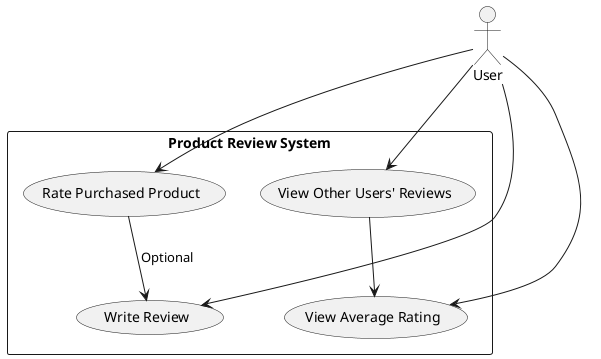
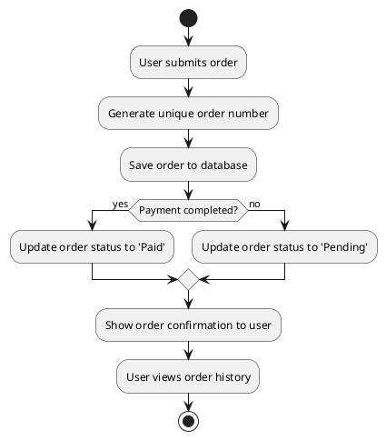
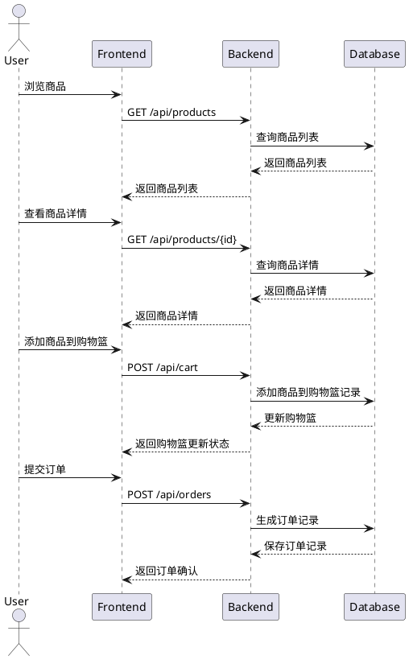
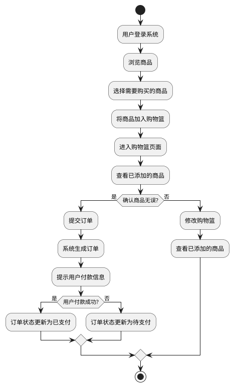

# 123
- 12








```plantuml
@startuml
actor Developer

participant "Version Control System (Git)" as VCS
participant "CI Tool (IntelliJ IDEA)" as CI
participant "Testing Server" as TS
participant "Deployment Server" as DS

Developer -> VCS : Push Code
VCS -> CI : Trigger Build
CI -> CI : Compile and Build
CI -> CI : Run Unit Tests
alt Tests Passed
    CI -> TS : Deploy to Testing Server
    TS -> CI : Run Integration Tests
    alt Integration Tests Passed
        CI -> DS : Deploy to Production
        DS -> CI : Deployment Confirmation
    else Integration Tests Failed
        CI -> Developer : Report Test Failures
    end
else Tests Failed
    CI -> Developer : Report Build/Test Failures
end
Developer -> VCS : Check Results

@enduml


