# 123
- 12

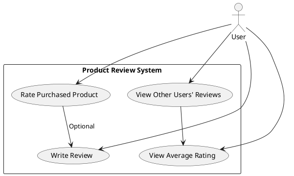
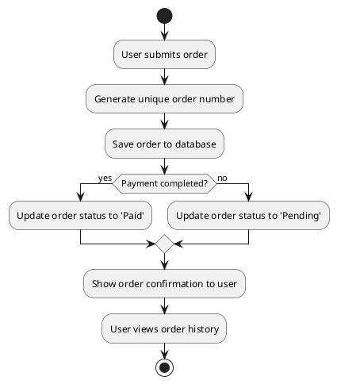

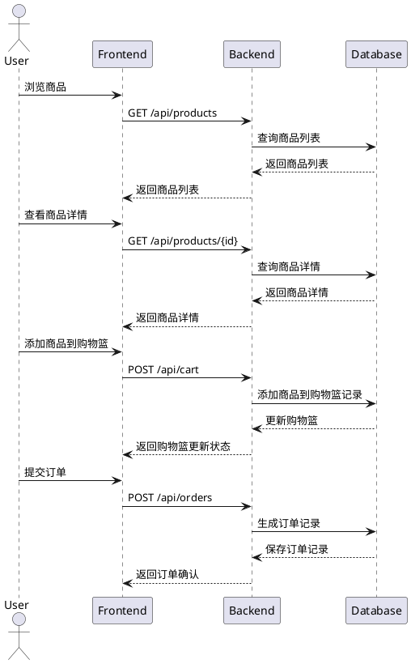

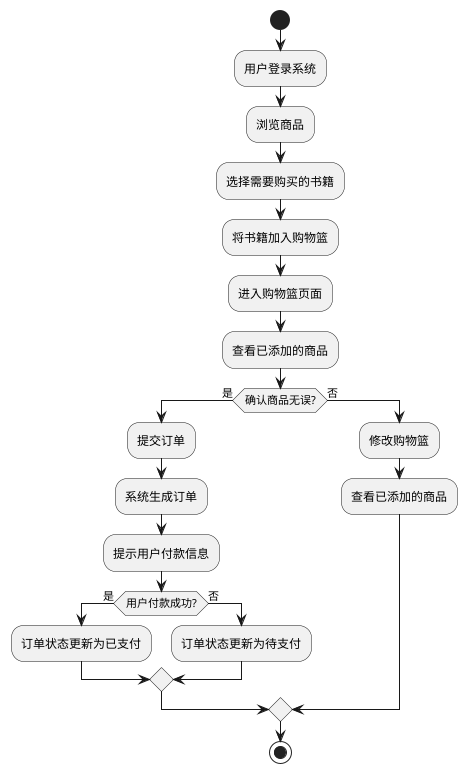

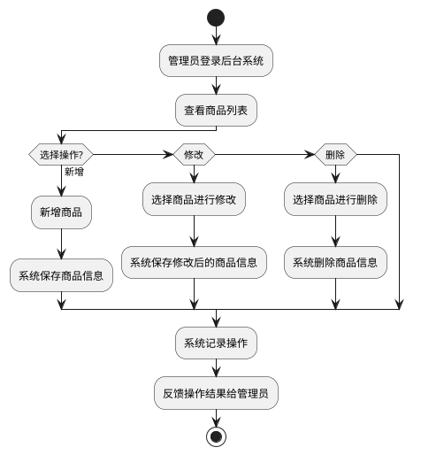

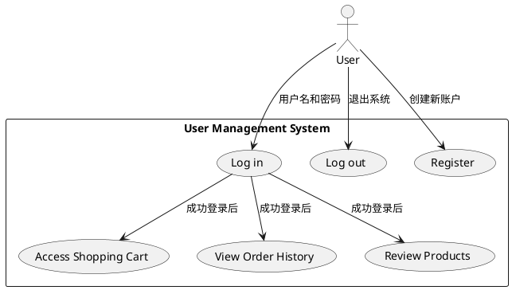

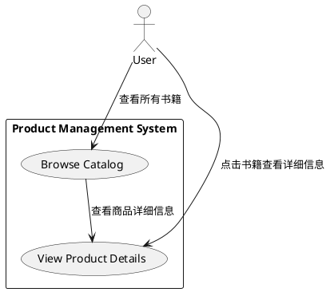

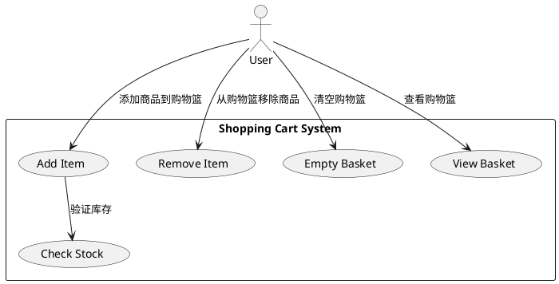

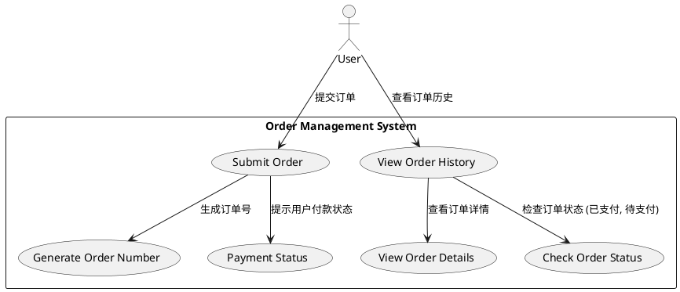

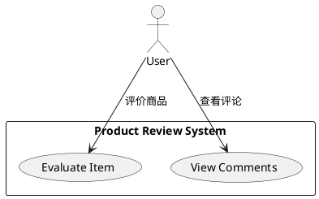

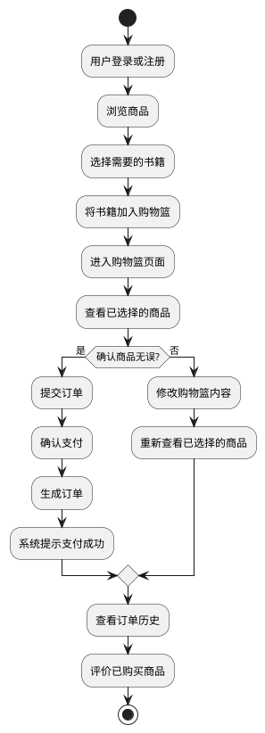

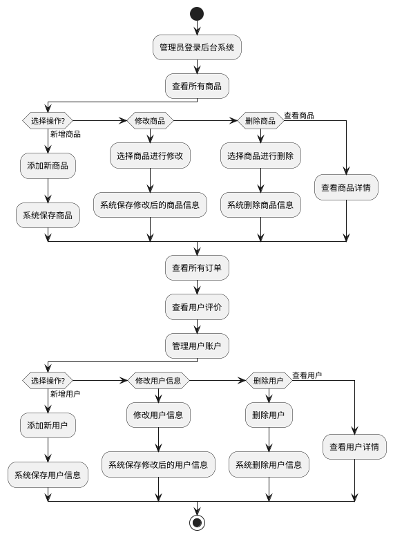

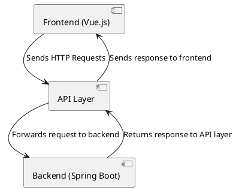

```plantuml
@startuml
node "Frontend (Vue.js)" {
  [Browser]
}

node "Backend (Spring Boot)" {
  [API Layer]
  [User Service]
  [Order Service]
  [Product Service]
}

node "Database" {
  [User Table]
  [Order Table]
  [Product Table]
}

Browser --> "API Layer" : HTTP Request
"API Layer" --> "User Service" : Manage Users
"API Layer" --> "Order Service" : Manage Orders
"API Layer" --> "Product Service" : Manage Products
"User Service" --> "User Table" : Query User Table
"Order Service" --> "Order Table" : Query Order Table
"Product Service" --> "Product Table" : Query Product Table

@enduml
